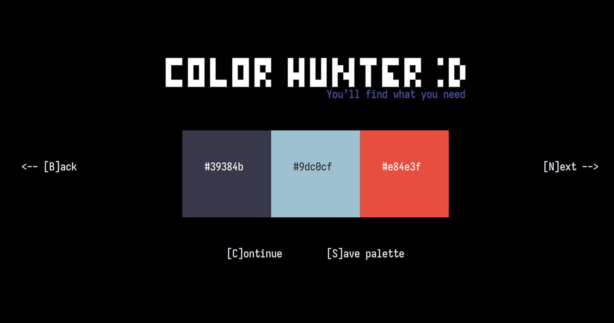

<p align="center">
    <picture>
      
    </picture>
</p>
<p align="center">Helper for searching individual colors in your terminal</p>
<p align="center">
</p>

### Idea

The idea came after visiting the site with palettes and I thought there were so many uniform and uninteresting palettes that I decided to create a tool that would give much more individual colors based on computer randomness.

### Installation

Install the necessary dependencies

```bash
 sudo apt install libcairo2-dev libfreetype-dev
```

#### Check the realese page

**or**

#### Build from source code

```bash
git clone https://github.com/aprogramq/color-hunter.git && \
sudo apt install gcc curl unzip xxd && \
cd color-hunter && bun i && bun run build.ts
```

### Contributing

Welcome any comments and fix bugs in my code.
