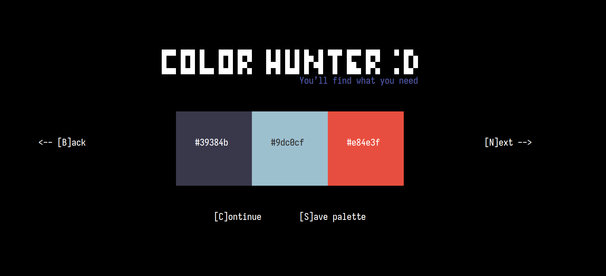

<p align="center">
    <picture>
      
    </picture>
</p>
<p align="center">Helper for searching individual colors</p>
<p align="center">
</p>

### Idea

The idea came after visiting the site with the palettes and I thought that there were so many familiar color palettes that I decided to create a tool that will give much more individual colors

### Installation
Check the realese page

or

Build from source code

```bash
bun build ./src/index.tsx --compile --outfile color-hunter 
```

### Contributing

Welcome your any comments about my code and also help