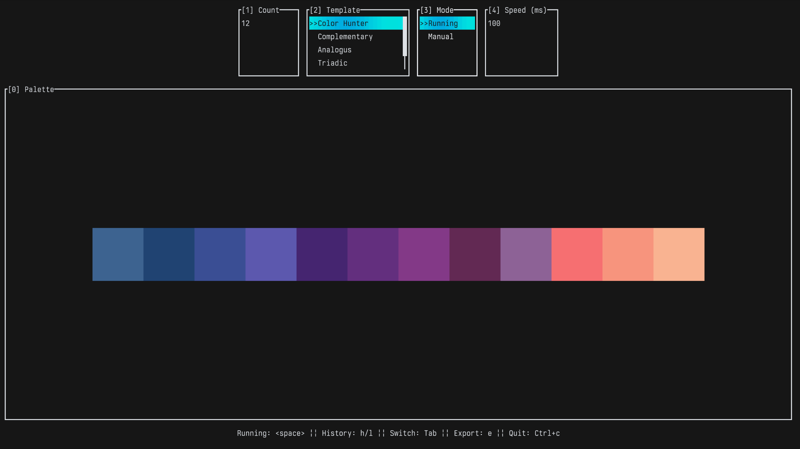
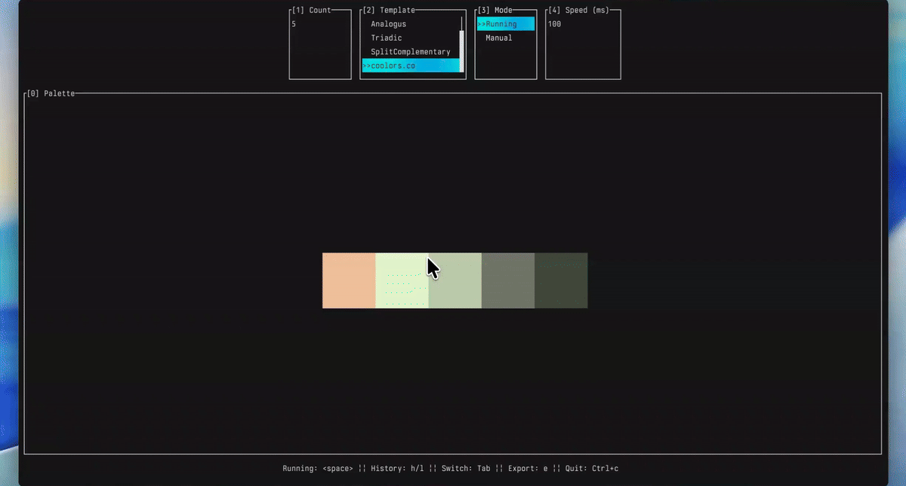

<div align="center">

# Color Hunter

**You'll find what you need**






</div>

## Features

- **Six palette generators**: Color Hunter, complementary, analogous, triadic,
  split-complementary, coolors.co.
- **Perceptual color generation** using OKLCH and OKHSL with sRGB gamut mapping.
- **Automatic and manual modes** with an adjustable generation interval.
- **Palette history** for navigating through up to 100 generated palettes.
- **First-class mouse support** for hovering, selecting, dragging, scrolling,
  and copying colors.
- **Keyboard-driven workflow** with Vim keys and arrow-key alternatives.
- **Range selection** to copy one color or a continuous group of colors.
- **Clipboard export** as CSS variables, SCSS variables, Tailwind colors, SVG,
  or PNG.
- **HEX, RGB, and HSL output** with human-readable color names.

## Roadmap

- [ ] **Ready-made palettes** — add a dedicated screen for browsing and copying
  ready-made color palettes.
- [ ] **More palette generators** — expand the collection of built-in templates
  for generating color palettes.
- [ ] **Custom generator API** — provide an API and integrate an embeddable
  scripting language(lua?), so users can create their own palette
  generation templates.

## Installation

Color Hunter currently targets Linux. You
need [Rust 1.88+](https://www.rust-lang.org/tools/install) and a terminal with
True Color support.

```bash
git clone https://github.com/aprogramq/color-hunter.git
cd color-hunter
cargo install --path .
color-hunter
```

## Configuration

Settings are saved automatically to:

```text
~/.config/color-hunter/config.toml
```

## License

Color Hunter is available under the [MIT License](LICENSE).

Color names are derived from
[color-name-list](https://github.com/meodai/color-names). See
[THIRD_PARTY_NOTICES.md](THIRD_PARTY_NOTICES.md) for attribution.
